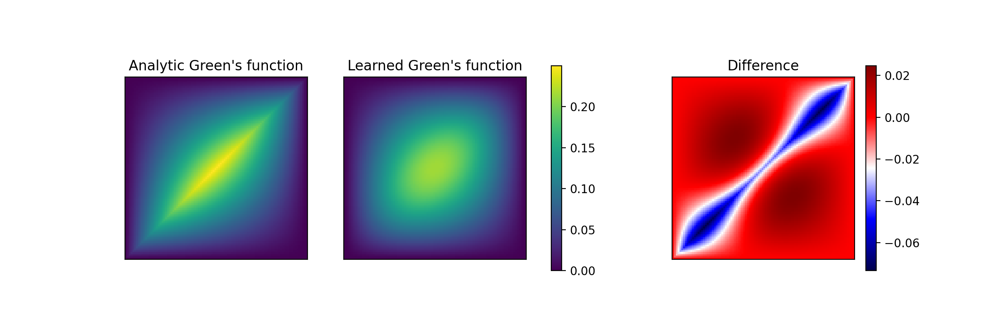

# Learning Green’s Functions as Operators

This project asks a simple question:

**Can we learn the inverse of a differential operator directly, instead of learning solutions?**

Instead of training a model to predict $u(x)$ point-by-point, we train a model to represent the *operator* that maps an input function $f(x)$ to an output function $u(x)$.  
Once that operator is learned, solutions emerge automatically by applying it. From an ML perspective, this can be viewed as learning a data-driven integral operator (kernel) rather than a pointwise predictor, similar in spirit to neural operator methods.

The goal here is not just accuracy, but understanding:
- what the model actually learns
- which physical constraints matter
- where and why the approach breaks

This is a physics-flavoured, math-first ML project.

---

## The intuition (no physics background needed)

Many physical systems behave like this:

> you give the system an input function → a fixed rule transforms it → you get an output function

For linear systems, that “fixed rule” can be written as an **integral kernel**:
$u(x) = \int G(x,x') f(x')dx'$

$G(x,x')$ is called a *Green’s function*. You can think of it as:
- a lookup table of how inputs at $x'$ influence outputs at $x$
- the inverse of the differential operator

**This project learns $G(x,x')$ itself**, using a neural network.

The model never sees the true Green’s function.  
It only sees examples of inputs $f$ and resulting outputs $u$.

---

## Optional theory background

The `theory/` folder contains short, self-contained PDFs that document the mathematical and conceptual background behind this project.

These are **not required** to understand or run the code, but they provide additional context for readers who want to dig deeper into:
- what a Green’s function represents
- why learning the operator (instead of the solution) makes sense
- how the modeling choices in this project are motivated

The PDFs are written to be readable alongside the code, not as a formal paper.

---

## The test problem

We work with a deliberately simple system:

- a 1D Poisson equation on $[0,1]$
- fixed zero boundary conditions
- known analytic solution

Why this choice?
- the physics is clean
- classical solvers exist
- failure modes are easy to interpret
- lessons generalize to harder PDEs

This is a *controlled experiment*, not a benchmark chase.

---

## Phase 1 — Establishing ground truth

Before using ML, we implement three classical solvers:
- analytic Green’s function
- finite difference
- spectral (sine-series) solver

All three agree numerically.  
This gives us a trusted reference and prevents “ML hallucinations”.

---

## Phase 2 — Generating meaningful data

We generate datasets of input–output function pairs $(f,u)$.

Key design choices:
- forcings are smooth functions with controlled frequency content
- no noise injection
- fixed train/validation/test splits
- spectral solver used as ground truth

The data is simple on purpose. Any failure later should come from modeling choices, not data issues.

---

## Phase 3 — Learning the operator

### What the model actually learns

The neural network represents a **kernel** $g_\theta(x,x')$.

From this kernel, solutions are produced via:
$[\hat u(x_i) = \sum_j g_\theta(x_i,x_j)\, f(x_j)h]$

The model is never trained on $g_\theta$ directly.  It is trained only on whether applying it produces the correct $u$.
In other words, the network is trained to approximate a mapping between function spaces, not a fixed-dimensional input–output map.

---

### Enforcing physics (by construction)

Two properties of the true Green’s function are enforced *architecturally*:

- **symmetry**: $G(x,x') = G(x',x)$  
- **boundary conditions**: $G(0,x') = G(1,x') = 0$

These are built into the model itself, not added as loss penalties.

These choices turn out to have a significant impact on stability and generalization.

---

## Phase 4 — Results and diagnostics

### Learned Green’s function

The learned kernel reproduces the **global structure** of the true Green’s function:
- correct shape
- symmetry
- zero boundaries

The main mismatch occurs near the diagonal $x=x'$, where the true kernel is non-smooth.

This is a known hard case for smooth neural parameterizations.

---

**Figure — Learned vs analytic Green’s function.**  
Left: analytic Green’s function for the 1D Poisson operator.  
Center: Green’s function learned by the neural operator.  
Right: difference (learned − analytic).

The model recovers the correct global structure, symmetry, and boundary behavior.  
The dominant errors are localized near the diagonal $x=x'$, where the true Green’s function has limited smoothness.

---

### Validation performance (operator generalization)

We evaluate the learned operator on a held-out validation set of unseen forcing functions.

Rather than measuring kernel error directly, we measure **solution error**, since the kernel is only meaningful through its action.

Relative $L^2$ error statistics on the validation set:

- mean error: **0.11**
- median error: **0.05**
- 90% quantile: **0.32**

Most validation cases are predicted accurately, while a smaller subset of harder inputs produces larger errors.  
These higher-error cases correlate with forcing functions that contain more high-frequency content.

Importantly, this behavior is structured rather than random, indicating that the model has learned a meaningful inverse operator rather than memorizing training data.

---

## Ablation studies: what actually matters

To understand which modeling choices are essential, we perform controlled ablations by removing individual physical constraints.
These ablations are not meant to optimize performance, but to test which inductive biases are essential versus optional.
All ablations are trained and evaluated under identical conditions.

---

### Removing symmetry (boundary conditions kept)

When symmetry is removed, the kernel is no longer constrained to satisfy $G(x,x') = G(x',x)$.

Validation performance improves slightly:

- mean error: **0.08**
- median error: **0.04**
- 90% quantile: **0.23**

This indicates that removing symmetry increases expressive freedom and allows the model to better fit the training distribution.

However, the learned kernel is no longer physically valid.  
This highlights a classic tradeoff between **inductive bias** and **empirical accuracy**: enforcing symmetry improves interpretability and correctness, but slightly restricts flexibility.

---

### Removing boundary conditions (symmetry kept)

When boundary conditions are not enforced architecturally, the learned kernel no longer guarantees $u(0)=u(1)=0$.

Validation performance degrades:

- mean error: **0.13**
- median error: **0.06**
- 90% quantile: **0.42**

For comparison, these errors are significantly lower than naive baselines that ignore operator structure, and degrade gracefully as input complexity increases.
In addition, predicted solutions exhibit clear boundary leakage, with maximum boundary violations on the order of $10^{-2}$.

This demonstrates that boundary conditions cannot be reliably learned from data alone and must be enforced by construction.

---

### Summary of ablations

These experiments show that not all physical constraints play the same role:

- symmetry acts as a soft inductive bias that trades flexibility for physical correctness
- boundary conditions are non-negotiable for stable and meaningful solutions

Understanding this distinction is essential for building reliable operator-learning models.

---

## What this project demonstrates

- Operators can be learned without direct supervision
- Architectural constraints are more reliable than loss penalties
- Some physics constraints are optional biases; others are non-negotiable
- Failure modes are interpretable and tied to known mathematical structure

---

## Why this project exists

This project is meant to show:
- modeling intuition over benchmark optimization
- careful numerical reasoning
- principled use of ML in a physics setting

It is written for readers who care about *understanding*, not just performance numbers.

---

## How I’d extend this

This project was designed as a controlled study rather than a performance-maximizing system. Based on the observed failure modes, several extensions are natural:

- **Diagonal-aware kernels**  
  Most kernel error is concentrated near $x = x'$, where the true Green’s function is non-smooth.  
  A hybrid parameterization that treats the diagonal and off-diagonal regions differently could improve accuracy without sacrificing interpretability.

- **Frequency-conditioned operators**  
  Validation errors increase for forcings with higher-frequency content.  
  Conditioning the kernel on spectral information or using multi-resolution representations could address this systematically.

- **Higher-dimensional operators**  
  Extending the approach to 2D elliptic PDEs would test scalability and reveal how architectural constraints generalize beyond one dimension.

- **Variable-coefficient problems**  
  Learning operators with spatially varying coefficients would require the kernel to depend explicitly on the input field, moving closer to realistic physical systems.

These directions follow directly from the diagnostics and ablations in this project, rather than being added for complexity.

---
